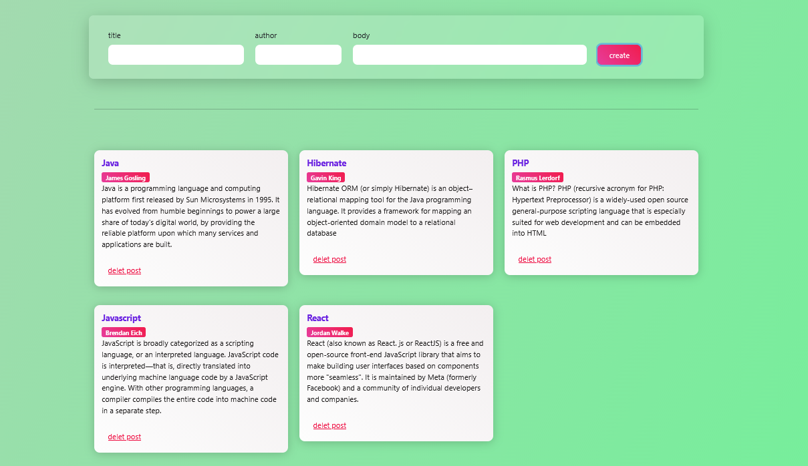

📝 Post Management App (OOP – Vanilla JavaScript)

A structured post management application built using Vanilla JavaScript (ES6 Classes) with a clear separation between business logic and UI layer.

This project demonstrates practical implementation of Object-Oriented Programming principles, state management, and browser storage without using any frameworks

---

 
🎯 Project Purpose

This project was developed to practice:

Designing modular front-end architecture

Applying OOP principles in real-world scenarios

Separating concerns (UI vs Data vs Storage)

Managing application state

Working with LocalStorage as a persistence layer

---
 
✨ Features

Create posts (title, author, body)

Delete posts

Persistent storage using LocalStorage

Automatic data hydration on page reload

Alert feedback system (success / error)

Responsive UI built with Bootstrap

Custom styling enhancements

---
 
🧠 Architecture Overview

The application follows a class-based modular structure:

Post

Represents the data model of a post.

uiPost

Responsible only for:

Rendering posts

Handling DOM manipulation

Showing alerts

Clearing inputs

No business logic is handled here.

store

Handles persistence layer:

Retrieve posts from LocalStorage

Save posts

Delete posts

Rehydrate state on load

---
 
🏗️ Separation of Concerns

Data Model Layer → Post

Business Logic Layer → Storage handling

Presentation Layer → UI class

State Persistence → LocalStorage

This separation improves maintainability and scalability

---
 
📦 Technologies Used

HTML5

CSS3

Bootstrap

JavaScript (ES6)

LocalStorage API

---
 
📊 What This Project Demonstrates

Practical OOP implementation in JavaScript

Modular architecture without frameworks

State-driven rendering

Encapsulation of responsibilities

Clean event handling

Basic persistence layer design

---
 
🔮 Possible Improvements

Introduce unique IDs instead of title-based deletion

Add edit/update functionality

Refactor UI class naming convention

Implement data validation layer

Convert storage layer to async API simulation

Add testing layer

Migrate architecture to MVC pattern

---

 
🚀 Live Demo

https://sepid-dev.github.io/postcreate/

---
 
📸 Preview

---

 
👨‍💻 Author

Developed as part of structured JavaScript OOP practice

